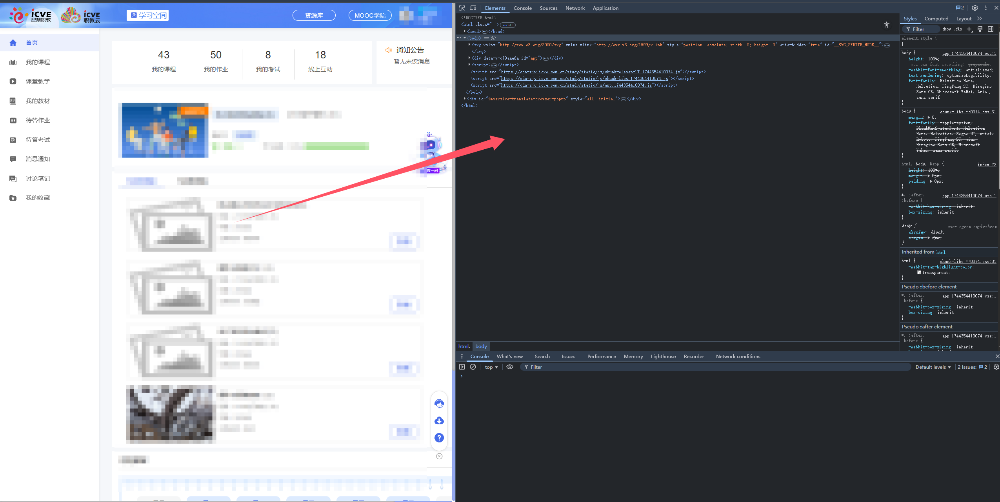
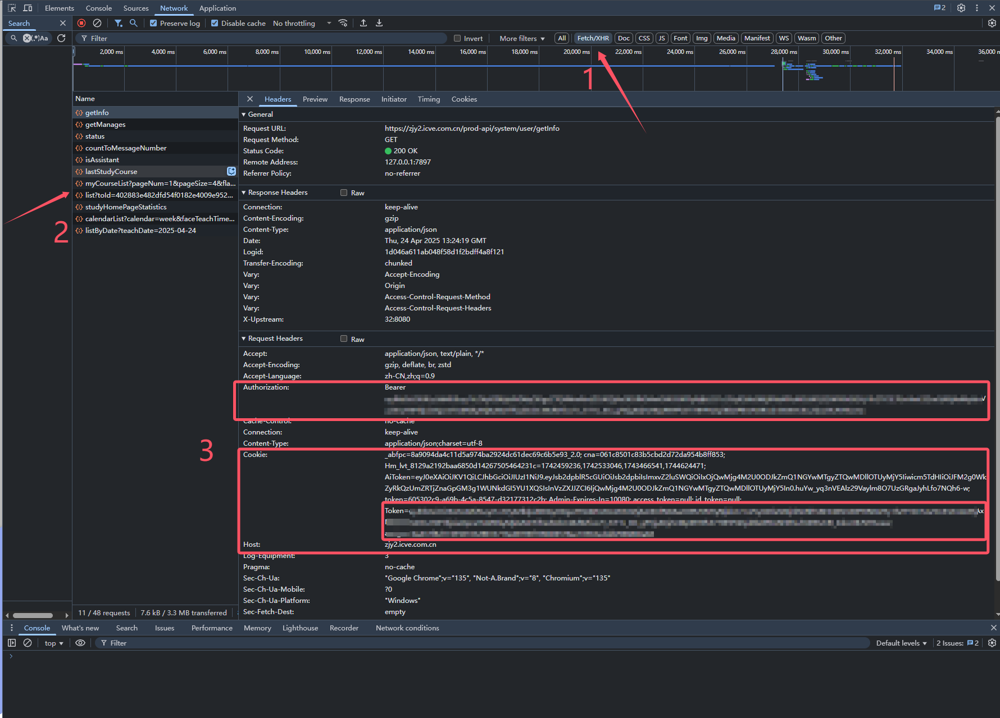

# icveHelper
icve智慧职教，课程进度提交

#### 1.安装requirements下的库

运行  pip install -r requirements.txt

#### 2.运行zhzj.py文件

执行 py zhzj.py  或  python zhzj.py

#### 3.获取Token

网页端登录icve智慧职教，网址 https://zjy2.icve.com.cn/index

F12打开Devtools，

点击Devtools中的网络(Network)，没有数据的话刷新网页，点击 Fetch/XHR

查看异步请求数据，任意选择一个数据进行点击，选择Authorization中的数

据，或者Cookie中的Token部分。

⚠ 注意：如果选择 Authorization 部分，不需要加入Bearer 头，注意不能有多余的空格

如果有任何问题或者bug，请在 Issues 中进行反馈提交

本人还是一枚大学牲，还是个菜鸡，如有错误请多包涵😂